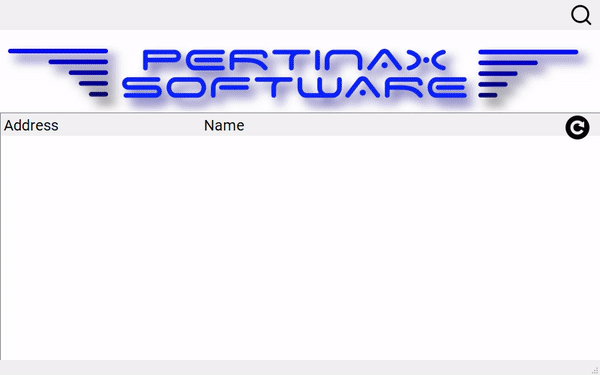

# Python OCA-UA demo for Diagraph ResMark printer

## Installation
- After you have cloned the repo:
    - Open a command prompt in the project's root folder  
    - Run:
        - ```pip install PyQt5 --upgrade```
        - ```pip install -r requirements.txt```

## Running the program
- From the command line: 
    - ```python main.py```
- From Visual Studio:
    - Open OpcUa.sln
    - Debug > Start Debugging (F5)

## Screenshots

